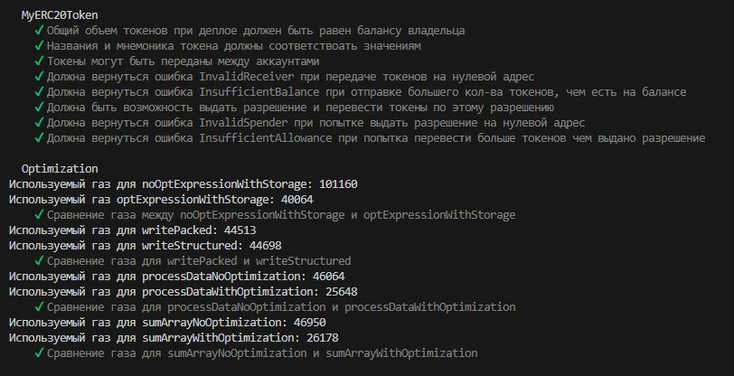
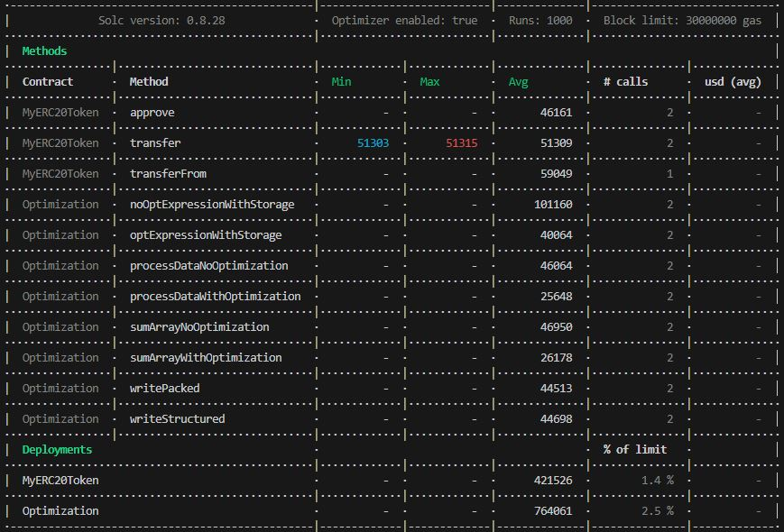

# Задание 3. Пишем unit-тесты
## Цель:
Написать набор unit тестов для вашего оптимизированного контракта с использованием фреймворка Hardhat


## Описание/Пошаговая инструкция выполнения домашнего задания:
1. Настройте окружение для использования Hardhat. Изучите основные функции и возможности этого инструмента.  
2. Напишите простой контракт на Solidity, который бы использовал storage, memory, stack и calldata, чтобы продемонстрировать различия в их работе и стоимости.  
3. Проанализируйте и оптимизируйте ваш контракт, написанный в пункте 2, с целью минимизации использования газа. Замерьте и сравните результаты до и после оптимизации.  
4. Напишите набор unit тестов для вашего оптимизированного контракта с использованием фреймворка Hardhat.
5. Созданный вами контракт должен быть протестирован (минимальным набором тестов).  
6. Код должен быть размещен в системе контроля версий (Github, Gitlab, etc.).

## Что сделано
1. Перенесен [контракт ERC20](https://github.com/khronic79/solidity-task3/blob/main/contracts/MyERC20Token.sol) из прошлого задания. Для этого контракта написан [набор тестов](https://github.com/khronic79/solidity-task3/blob/main/test/MyERC20Token.ts).
2. В контракте [Optimization](https://github.com/khronic79/solidity-task3/blob/main/contracts/Optimization.sol) несколько пар фукнций с описание в комментариях, где одна функция не оптимизированна, а вторая оптимизирована. Для данного контракта также написан [набор тестов](https://github.com/khronic79/solidity-task3/blob/main/test/Optimization.ts) для отображения разницы величины газа между оптимизированными функциями и нет.
3. Скриншот результата тестов

4. Скриншот отчета по газу.


## Как запустить тест на локальной машине
Для запуска необходимо, чтобы на локальной машине было установлен программное обеспечение Node js.
1. Необходимо склонировать репозиторий:
```shell
git clone https://github.com/khronic79/solidity-task3.git
```
или
```shell
git clone git@github.com:khronic79/solidity-task3.git
```
2. Установить зависимости для Node js, например:
```shell
npn init
```
3. Запустить тест:
```shell
npx hardhat test
```
